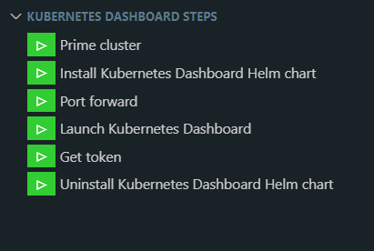

# vscode-kubernetes-dashboard

# Kubernetes Dashboard

UPDATE: Now works with Kubernetes 1.24 as well.


This extension supports following commands:

| Step  | Command                                     | Category                    | Description |
|-------|---------------------------------------------|-----------------------------|-------------|
|    0  | _Create Kind cluster_                       | Kubernetes Dashboard: Kind: | Create a 3 node Kind cluster. This step is _**optional**_. |
|       |||
|    1  | Prime cluster                               | Kubernetes Dashboard:       | Prime the current cluster for deploying the Kubernetes Dashboard Helm chart |
|    2  | Install Kubernetes Dashboard Helm chart     | Kubernetes Dashboard: Helm: | Install Kubernetes Dashboard Helm chart |
|    3  | Port forward                                | Kubernetes Dashboard:       | Forward port 8443 (only supported on MS Windows) |
|    4  | Launch                                      | Kubernetes Dashboard:       | Launch Kubernetes Dashboard Web UI
|    5  | Get token                                   | Kubernetes Dashboard:       | Get token for signing into Kubernetes Dashboard Web UI |
|       |||
|       | _Uninstall Kubernetes Dashboard Helm chart_ | Kubernetes Dashboard: Helm: | Uninstall Kubernetes Dashboard Helm chart |
|       |||

You can also use the ```Kubernetes Dashboard Steps View``` to invoke the above commands:



You can also show the resources in ```Kubernetes Dashboard``` from the context menu of resources in the ```Kubernetes:Clusters``` Explorer view.

**IMPORTANT NOTE:** The **Prime Cluster** command configures the following service account:

```
# Service accounts to work with kubernetes-dashboard
---
apiVersion: v1
kind: ServiceAccount
metadata:
  name: admin-user
  namespace: kubernetes-dashboard
---
apiVersion: rbac.authorization.k8s.io/v1
kind: ClusterRoleBinding
metadata:
  name: admin-user
roleRef:
  apiGroup: rbac.authorization.k8s.io
  kind: ClusterRole
  name: cluster-admin
subjects:
- kind: ServiceAccount
  name: admin-user
  namespace: kubernetes-dashboard
---
apiVersion: v1
kind: Secret
type: kubernetes.io/service-account-token
metadata:
  name: admin-user-secret
  namespace: kubernetes-dashboard
  annotations:
    kubernetes.io/service-account.name: admin-user
```

The _**Create Kind cluster**_ command create the Kind cluster using the following configuration:

```
# three node (two workers) cluster config
kind: Cluster
apiVersion: kind.x-k8s.io/v1alpha4
nodes:
- role: control-plane
- role: worker
- role: worker
```